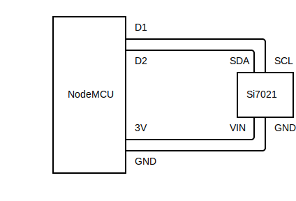

# Si7021 IoT node

NodeMCU with a Si7021 temperature and humidity sensor as an IoT node.

See http://particleflux.codes/post/2019/iot-temperature-and-humidity-sensor/

## Wiring

* NodeMCU _D1_ to Si7021 _SCL_
* NodeMCU _D2_ to Si7021 _SDA_
* NodeMCU _3V_ to Si7021 _VIN_
* NodeMCU _GND_ to Si7021 _GND_

